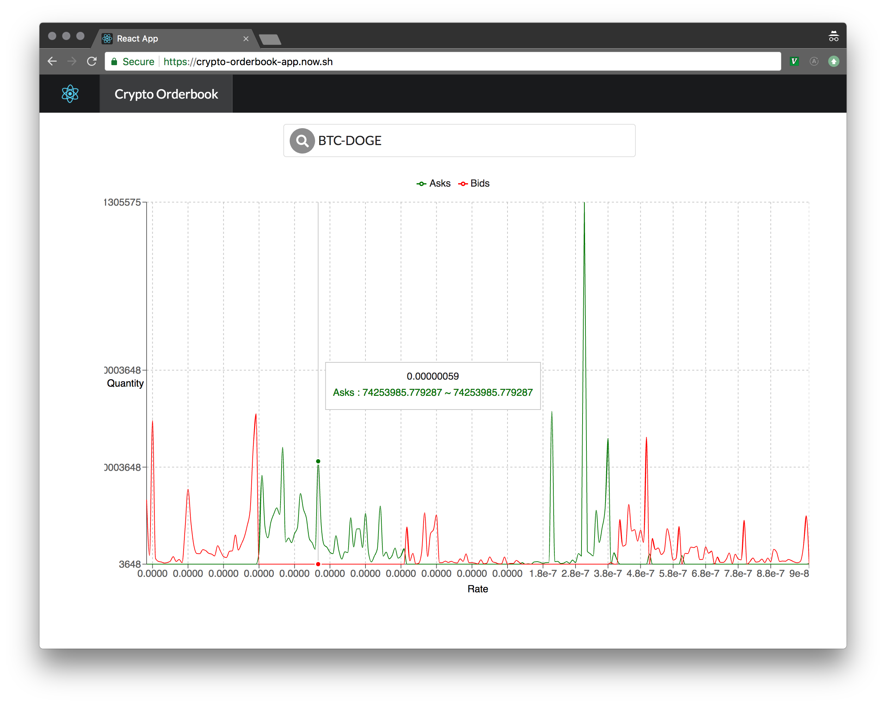

# Crypto Orderbook API

A combined orderbook API sourcing from `bittrex` and `poloniex`. Built with express, ramda, sanctuary, typescript, jest, nock, and more. The API is deployed at the following URL and has `GET` routes for `/` and `/orderbook`.

- **Live At**: [https://crypto-orderbook-app.now.sh](https://crypto-orderbook-app.now.sh)
- **Companion APP**: [https://github.com/rjhilgefort/crypto-orderbook-app](https://github.com/rjhilgefort/crypto-orderbook-app)

---

